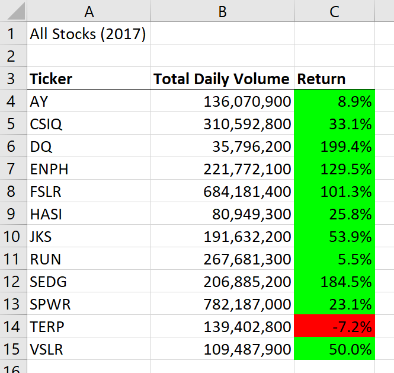
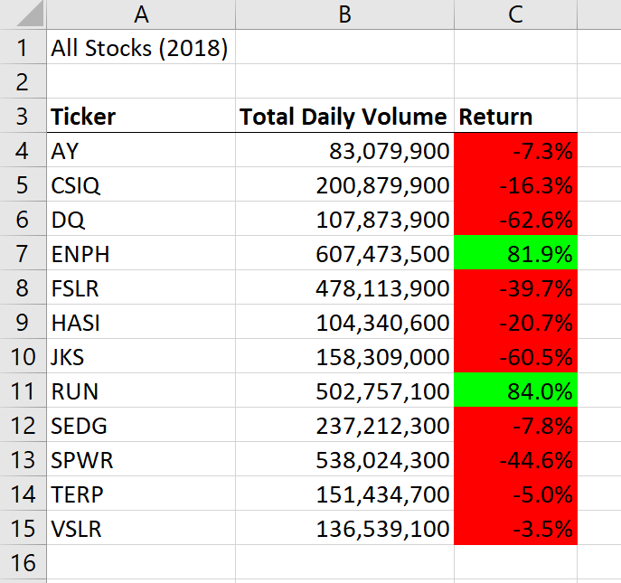
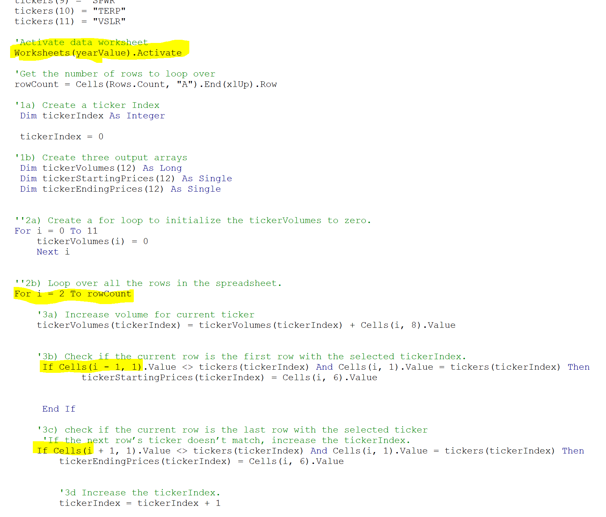

# Stock-Analysis Using VBA
## 1. Overview

Steve wanted to expand the capabilities of the spread sheet to analyze the entire data set. To achieve this, VBA code was used and a script to loop through the entire data sets for 2017 and 2018. Only 12 ticker symbols were provided in the data sets and the closing prices were used to determine the returns.

### 2. Results
Overall, for these 12 stocks, 2017 saw a better performance compared with 2018. Image 1 and image 2 shows the table of results through the VBA analysis. In image 1 it was observed that all but 1 stock had positive returns except TERP. 

 
 

While in image 2 all but 2 stocks had negative returns. Only ENPH and RUN had positive returns at the end of 2018. To achieve this analysis a VBA module was used to iterate through the data sets to produce a summarized version of the data. Firstly an input function was implemented into the code to allow the user to select between 2017 and 2018 data sets. While a for loop was used to iterate through the data sets and the calculations were bound by conditional statements to product the total volume for each ticker symbol. The return was calculated using the end price divided by the starting price minus 1. This provided the percentage of return from each symbol. An example of the code can by found below. 

Image 3 shows that an extra loop was used to initialize tickerVolumes into an array. This increased the amount of time needed to run the code. The array tickerVolumes would not need to be created before the loop unless the place in memory needed to be secured before calculations began on that variable.  

### 3. Summary 
3.1. What are the advantages or disadvantages of refactoring code?
The advantage of refactoring code is it saves time when trying to achieve the end result. Overall calculations are already set in place and general logic guidelines based on the requirements have already been roughly outlined. However, this may prevent creative solutions from occuring when tackling open ended problems. Depending on how complex the framework code is, the run times could be longer than a scratch code. Once minimum requirments are satisfied by the refactored code, very little optimization would occur unless needed. 
3.2. How do these pros and cons apply to refactoring the original VBA script?
The main difference between the original script and refactored was the extra declaration loop for totalVolumes. The non-refactored script just delcared the variable at the sametime of excuting the function. Which seemed to decrease the run time compared with the refactored script. Instantiating the volume array would be a safer way to code when the code becomes more complex. That way the memory for that variable is secured before other factors overwrite. 
